### C - E - L    TECHNOLOGY

### Realizado por:
- Carlos Lopez 
- Correo electronico carlospez.28@gmail.com

## Descripción
Este es un programa para tomar una encuesta de empleados en una empresa de tecnologia, Permite interactuar únicamente a través de la consola. El mismo se realizo utilizando Python 3.

## Función principal
Desplega un menú de opciones para que el usuario pueda realizar las siguientes funciones:   
- Opcion  ( A ): Ingresar datos del empleado. 

- Opcion ( B ): Seleccionar filtros de busquedas (maximo 3 filtros se pueden aplicar) y muestrar la "cantidad" y los  empleados que coinciden con la busqueda.  

- Opcion ( C ): Seleccionar filtros de busquedas (maximo 3 filtros se pueden aplicar) y muestrar el "porcentaje" y los  empleados que coinciden con la busqueda.

- Opcion ( D ): Seleccionar filtros de busquedas (maximo 3 filtros se pueden aplicar) y muestrar el "empleado de mayor edad" que coinciden con la busqueda.

- Opcion ( E ): Muestra los datos de todos los empleados que hicieron la encuesta en formato de tabla.

- Opcion ( X ): Guarda los datos en un archivo csv y cierra el programa.
 
los datos iniciales los lee de un archivo csv que luego se parsea a una lista de diccionarios y que posteriormente se normalizan cada valor al tipo de dato correcto .

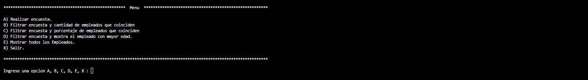
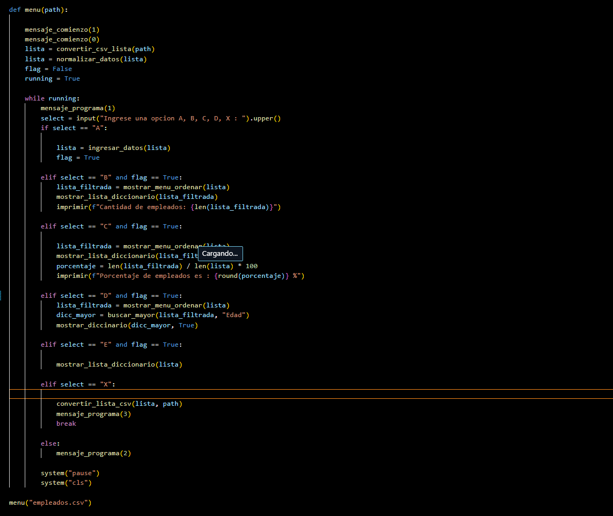

## Descripción de cada opcion {A, B, C, D, E} del menú principal

- ### Funcion ingresar datos ( Opcion A ) : 
    Esta  funcion permite ingresar los datos por terminal haciendo uso de otras funciones get que solicitan el dato, funciones que validan el tipo de dato, y una funcion que creea un diccionario.
    
    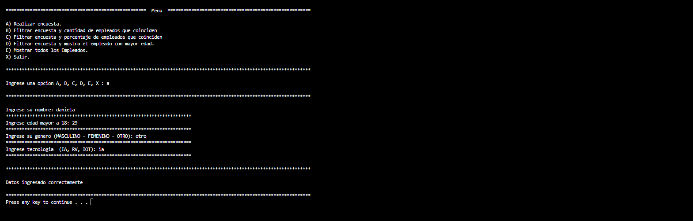

    Funcion para pedir datos

    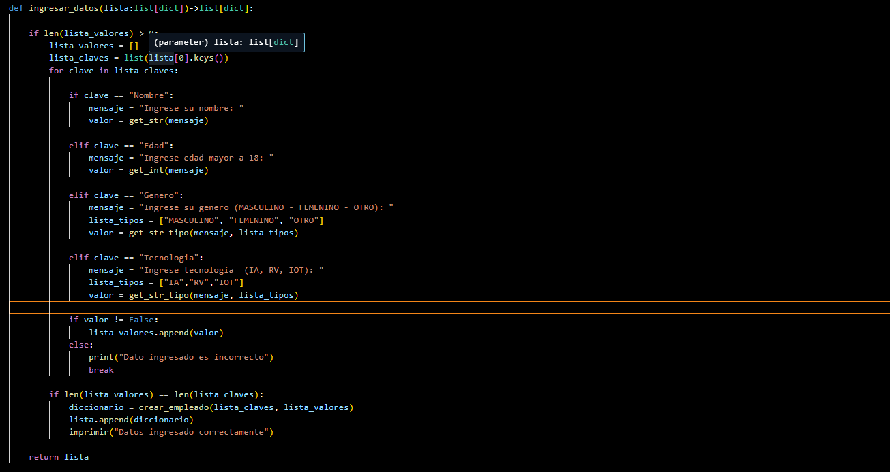

    Funcion para pedir dato

    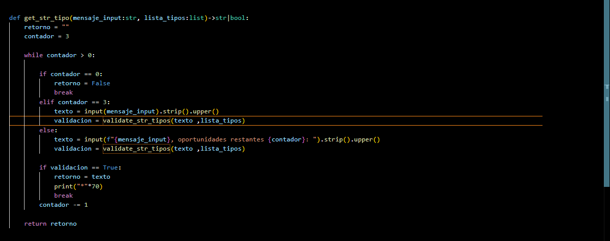

    Funcion para validar dato

    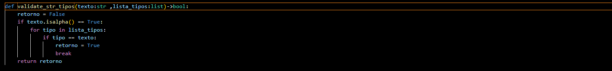

    Funcion para crear un diccionario

    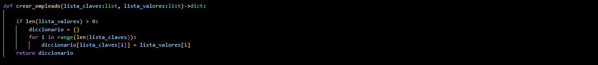

- ### Funciones para filtra ( Opcion B, C, D ) :
    Esta funcion permite seleccionar filtros por el usuarios y genera una busqueda por los filtros elegidos. Dependiendo la opcion seleccionada en el menu principal se puede obtener la cantidad, porcentaje y el empleado de mayor edad.

    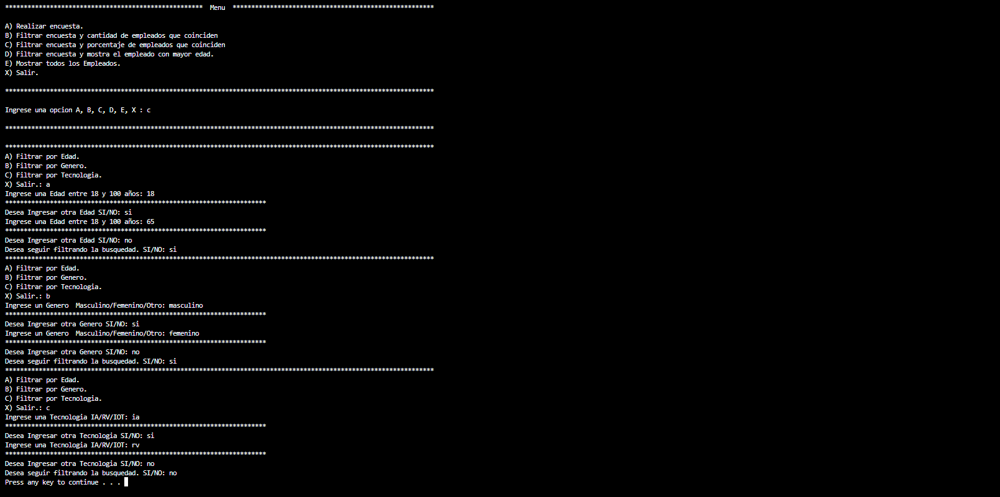

    Se muestra el resultado de la busqueda

    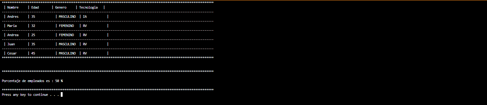

- ### Mostrar todos los empleados ( Opcion E ):
    Muestra los todos los encuestados en formato de tabla.

    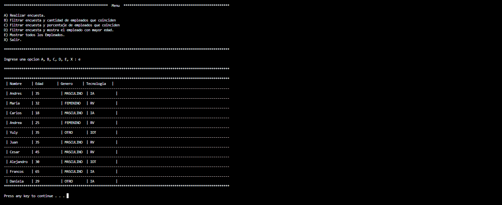

    Funcion para recorre la lista y mostrar cada elemneto de la lista (diccionarios)

    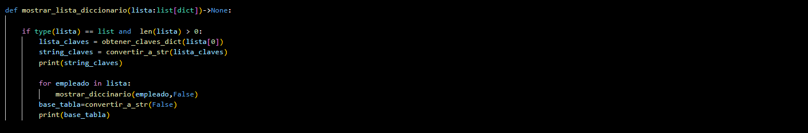

    Funcion para mostrar un elemento de la lista (diccionarios)

    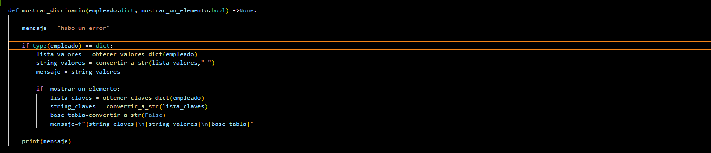

    Funcion para dar formato a una lista

    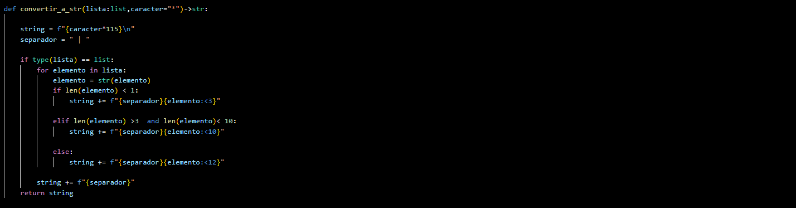

## Link del proyecto
- [Proyecto](https://github.com/carlosgithub1506/C.E.L-TECHNOLOGIES)

## Link del video
Video del programa en ejecucion 
- [Video](https://youtu.be/3YiyrspHqjI)

## Contacto
- Correo electronico carlospez.28@gmail.com
